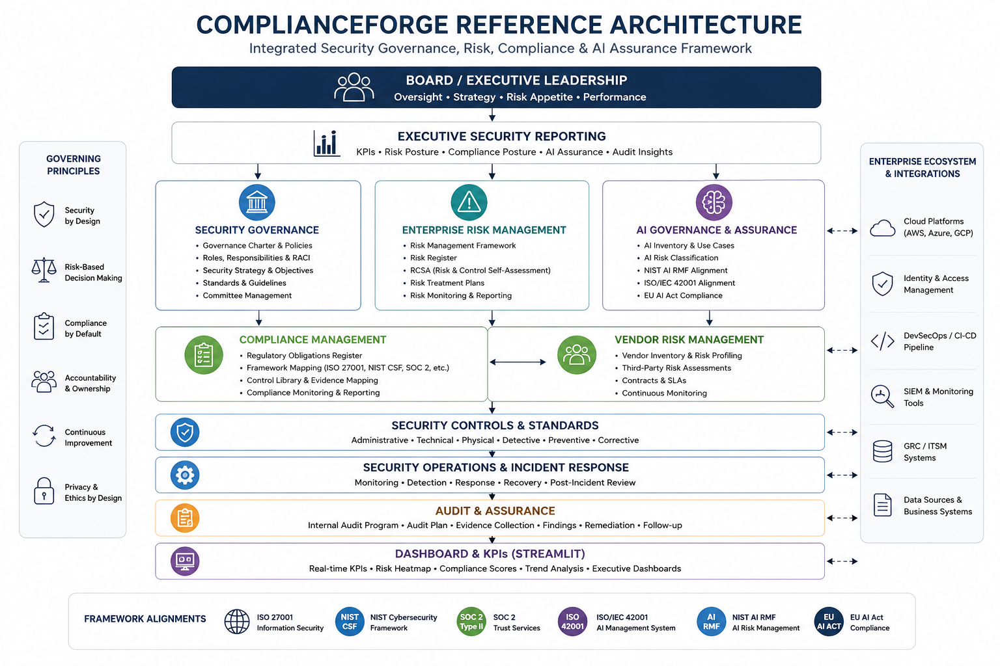
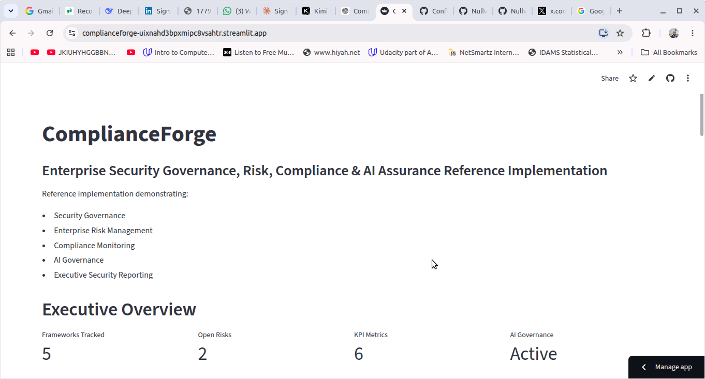
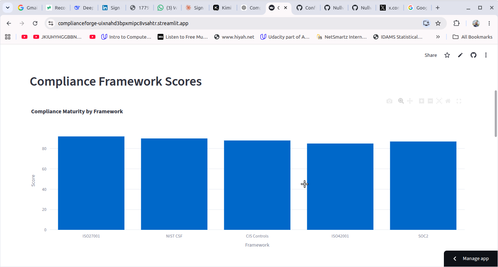
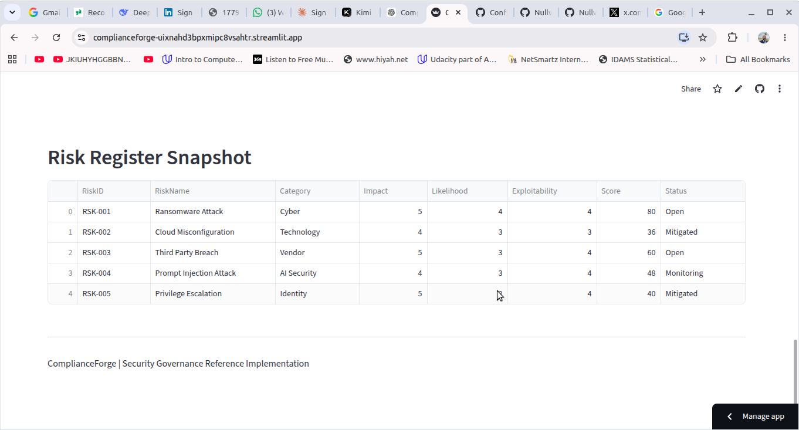

# ComplianceForge

[](LICENSE)
[](https://github.com/jkboamah/ComplianceForge)
[](https://github.com/jkboamah/ComplianceForge)

**Open‑source Governance, Risk & Compliance (GRC) reference implementation for modern cloud and AI‑driven enterprises.**

This project simulates a real‑world enterprise compliance transformation. It demonstrates how to operationalize security governance, risk management, and regulatory compliance using **Governance‑as‑Code** and **DevSecOps** principles.

> **Target audience:** GRC professionals, security architects, compliance engineers, AI governance leads, and hiring managers.

## Disclaimer

This repository is a cybersecurity governance, risk, compliance, and AI assurance reference implementation created for educational, research, portfolio, and consulting demonstration purposes.

All organizations, systems, assets, risks, controls, and scenarios represented within this repository are illustrative examples and do not represent any real company, client, or engagement.

---

## 🎯 Key Features/Capablilities 

- ✅ **Enterprise GRC artifacts** – Policy register, risk register, RCSA, vendor risk, KRI dashboard, issue register
- ✅ **Multi‑framework alignment** – ISO 27001, SOC2, NIST CSF, CIS Controls, GDPR, PCI DSS
- ✅ **Complete AI governance** – ISO/IEC 42001, NIST AI RMF 1.0, EU AI Act (high‑risk obligations)
- ✅ **AI‑specific registers** – AI risk register, AI system inventory, prompt injection lab
- ✅ **Governance‑as‑Code** – GitHub Actions, compliance automation scripts
- ✅ **Audit‑ready evidence** – Evidence register, control mappings, obligations tracker
- ✅ **Security Metrics & KPI Monitoring** 
- ✅ **Incident Response Management**
- ✅ **DevSecOps Security Automation**
- ✅ **Executive Security Reporting**
- ✅ **Vendor Risk Management**
- ✅ **Compliance Framework Mapping**


---
## Reference Architecture



## Live Dashboard

Explore the interactive executive reporting dashboard:

https://complianceforge-uixnahd3bpxmipc8vsahtr.streamlit.app/

## 📚 Frameworks & Standards Covered

| Domain | Frameworks |
|--------|------------|
| **Information Security** | ISO/IEC 27001:2022, SOC2 (Trust Services Criteria), NIST CSF v1.1, CIS Controls v8 |
| **Privacy & Industry** | GDPR, PCI DSS v4.0 |
| **AI Governance** | ISO/IEC 42001:2023, NIST AI RMF 1.0, EU AI Act (high‑risk AI obligations) |

---

## 📂 Repository Structure
```text
ComplianceForge/
├── governance/
├── risk/
├── controls/
├── compliance-mappings/
├── dashboards/
├── evidence/
├── incident-response/
├── automation/
├── inventory/
├── ai-governance/
├── threat-intelligence/
├── architecture/
└── README.md
```


---

## 🚀 Getting Started

1. **Clone the repository**  
   ```bash
   git clone https://github.com/jkboamah/ComplianceForge.git
   cd complianceforge

Explore the artifacts – Start with governance/policy-register.md and risk/risk-register.md.

Run the compliance dashboard (requires Python + Streamlit)

bash
pip install streamlit pandas plotly
streamlit run dashboards/compliance_dashboard.py


## Dashboard Preview

### Executive Overview



### Compliance Framework Monitoring



### Enterprise Risk Register




📊 Key Artifacts Showcase
Governance
Policy Register – 8 enterprise policies with owners, review cycles, and status.

Charter – Defines the GRC program structure and accountability.

Risk Management
Risk Register – Impact × Likelihood × Exploitability scoring.

Vendor Risk Register – Tiered assessment for AWS, OpenAI, Microsoft, etc.

RCSA Workbook – Inherent vs residual risk for 6 key processes.

AI Risk Register – 5 AI‑specific risks (prompt injection, model drift, poisoning, transparency, compliance).

Compliance & Controls
Obligations Register – Maps GDPR, ISO 27001, SOC2, PCI DSS, EU AI Act, ISO 42001, NIST AI RMF.

Issue Register – Track findings from audits and assessments.

AI Governance (Differentiator)
ISO/IEC 42001 – Full clause and Annex A mapping.

NIST AI RMF 1.0 – Govern, Map, Measure, Manage functions.

EU AI Act – High‑risk obligations (conformity assessment, human oversight, transparency).

AI System Inventory – 4 AI systems with risk classification.

Dashboards & Metrics
KRI Dashboard – MFA coverage, vulnerability aging, phishing click rate, MTTD/MTTR.

Security KPIs – Executive‑level metrics with targets.

🧠 Why This Project Matters for Your Career
If you’re targeting GRC, security consulting, compliance engineering, or AI governance roles, this repository demonstrates:

📋 Documentation maturity – Real artifacts, not just checklists.

🔗 Framework mapping – You can connect policies to controls to evidence.

🤖 AI governance fluency – ISO 42001, NIST AI RMF, EU AI Act – topics most candidates ignore.

🔄 Governance‑as‑Code – Automation and version control for compliance.

📊 Executive reporting – Dashboards and KPIs that speak to leadership.

📄 License
MIT License – free to use, adapt, and showcase in your portfolio.

🌟 Show Your Support
If you find this project useful for your own GRC learning or career, star the repository and share it on LinkedIn with:  https://github.com/jkboamah/ComplianceForge

“I built an open‑source enterprise GRC reference implementation covering ISO 27001, SOC2, and complete AI governance (ISO 42001, NIST AI RMF, EU AI Act). Check it out: https://github.com/jkboamah/ComplianceForge”

🙏 Acknowledgements
Inspired by real‑world compliance programs at cloud‑native FinTech companies.

Built as a reference implementation – not a commercial product.

All framework mappings are for educational and portfolio purposes.

Maintained by James Kwasi Boamah –
Open to GRC roles, security consulting, and AI governance opportunities.


---


